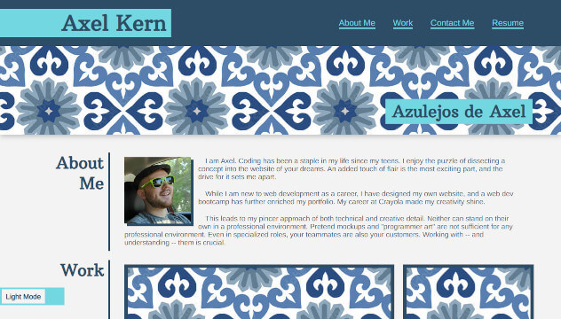

# Professional Portfolio

## Description

My work portfolio for web development. It has information about myself and my strengths as a dev, as well as samples of my work and contact information. Highlighting one's accomplishments and worth communicate them to employers and promote mental health.

## Features

In addition to the actual content, my portfolio includes robust styling, a dark mode option, and content fading-in as it comes into view.

## Installation

Visit [this link](https://axeljk.github.io/uw_m02_portfolio/) to view.

 ## Credits

- Axel Kern, creator
- W3Schools, reference for CSS and JS
- Joe Rehfuss, directing me toward the Intersection Observer API
- Abbey Free, supporting me in all things

## License

This project falls under the MIT license.